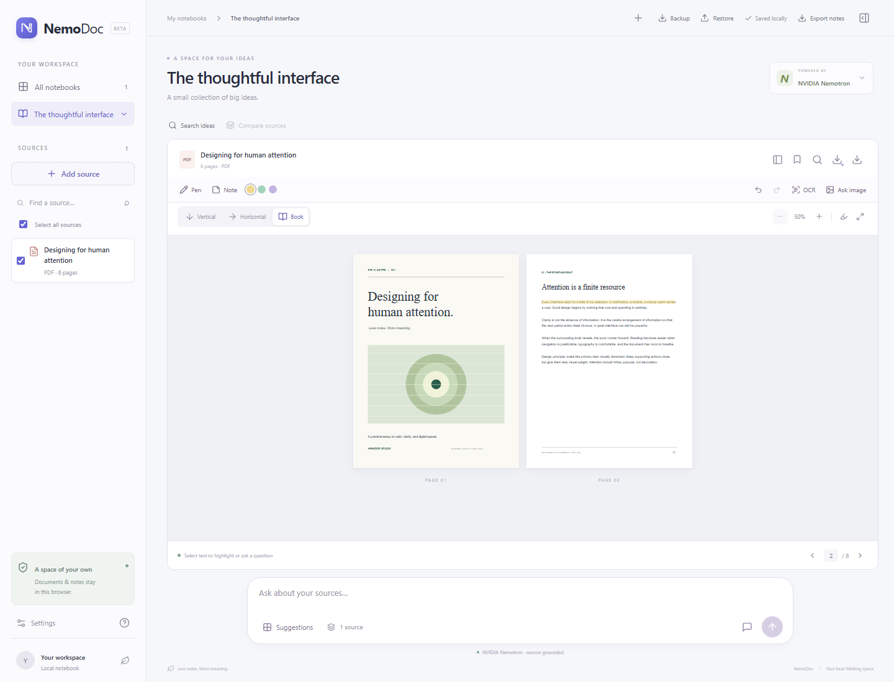
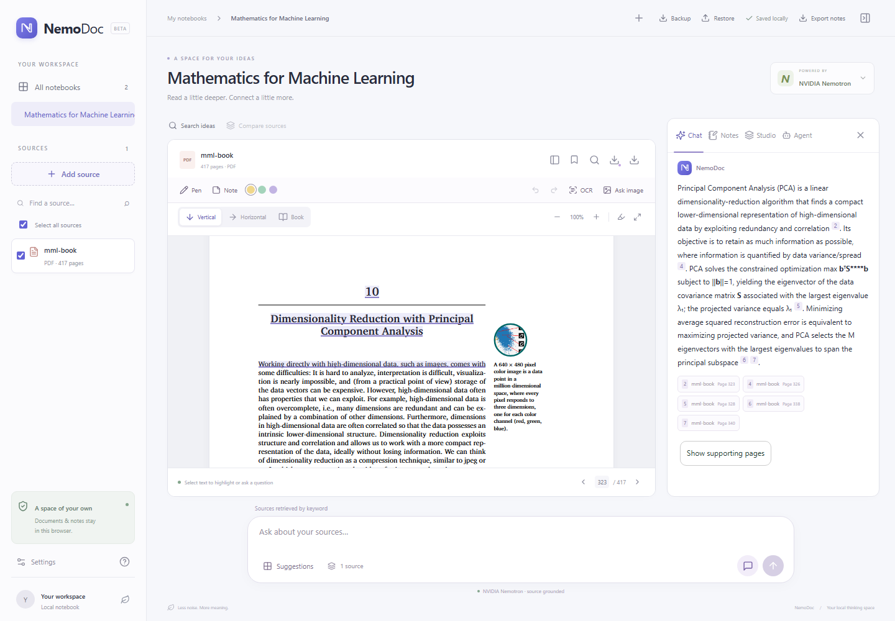
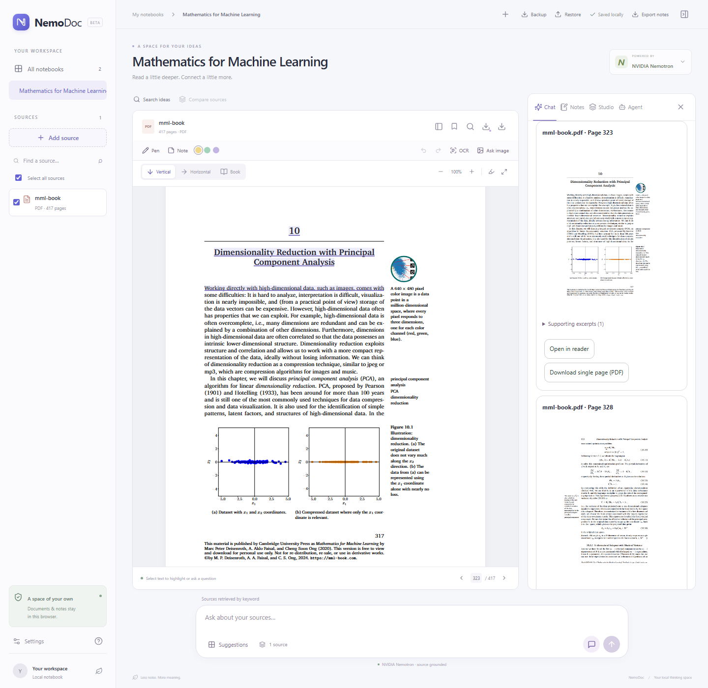
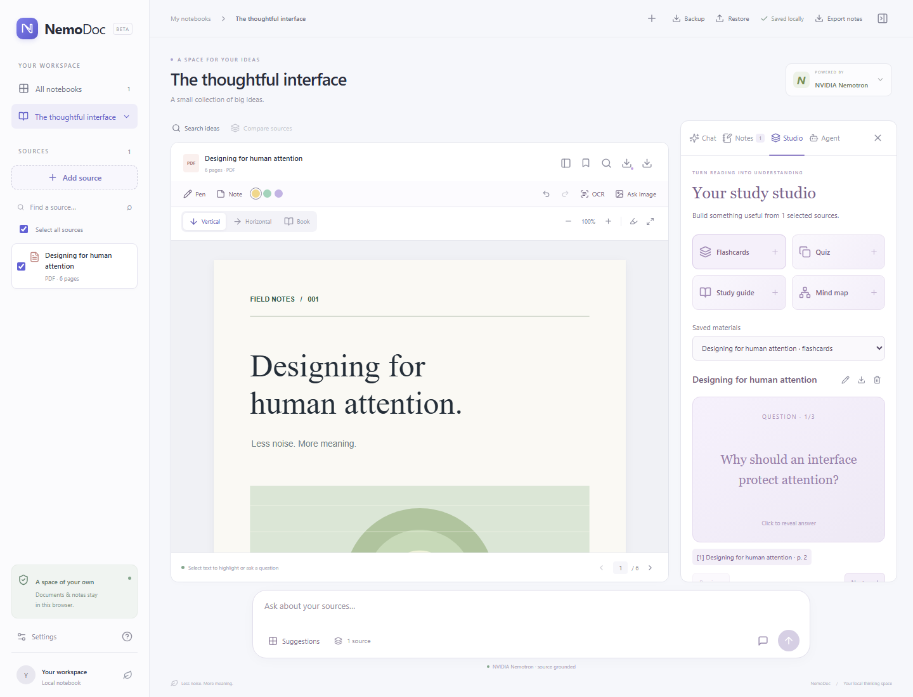
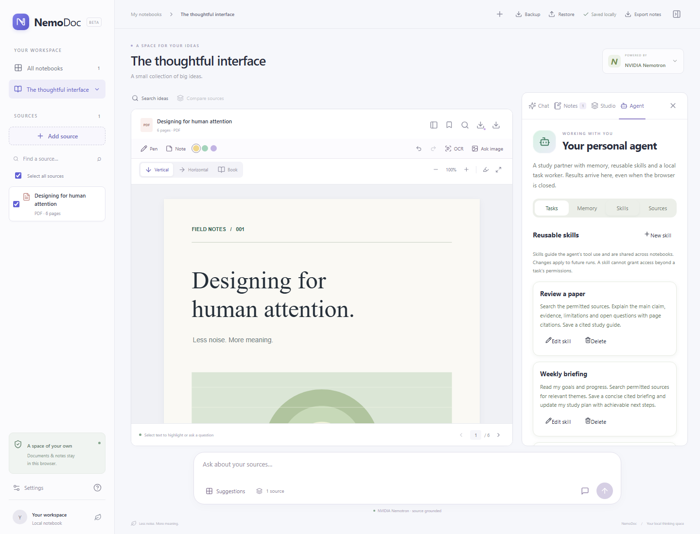

# NemoDoc

**Your PDFs and lectures, turned into a notebook you can think with.**

NemoDoc is a local, NotebookLM-style workspace powered by **NVIDIA Nemotron**. Bring your sources, ask questions, and follow citations back to the original pages.



## What can you do?

- **Read your way.** Open PDFs and PowerPoint slides in vertical, horizontal, or book views.
- **Make it yours.** Highlight, underline, draw, and collect notes as you read.
- **Ask with evidence.** Chat with your sources and click citations to check the original page.
- **Save the relevant pages.** Preview supporting pages in chat and download individual pages or slides.
- **Study smarter.** Create flashcards, quizzes, guides, and mind maps, with an agent that remembers your goals.

## Start with a source. Follow your curiosity.

1. **Add your sources** to a notebook, or explore the included sample.
2. **Read and ask** using a selected passage or the bottom chat bar.
3. **Keep learning** with notes, **Studio** practice, and **Agent** tasks using sources you approve.

## See it in action

### Understand a topic

> Explain principal component analysis and how it reduces dimensionality.

Nemotron explains the topic from the book. A citation opens the evidence beside your answer.



### Get the pages behind the answer

> Return the supporting pages about principal component analysis so I can download them.

Preview the original pages, then choose **Open in reader** or **Download single page (PDF)**.



Real Nemotron responses through Nebius, using [Mathematics for Machine Learning](https://mml-book.github.io/) by Marc Peter Deisenroth, A. Aldo Faisal, and Cheng Soon Ong (Cambridge University Press).

<details>
<summary><strong>Explore Studio and your personal agent</strong></summary>

Turn a chapter into practice materials in Studio.



Your agent remembers goals and learning progress, and runs approved study tasks. Keep the local server running for scheduled tasks.



These overview screenshots use the sample notebook; Studio shows demo content.

</details>

## Try it locally

Install **Node.js 22 or newer**, then run:

```sh
npm install
npm run dev
```

Open [localhost:5173](http://127.0.0.1:5173). To enable AI, open **Settings → Nebius**, enter your **Nebius Token Factory API key**, and choose **Save & test**. You can read and annotate before connecting a model.

### Open models, your choice of runtime

NemoDoc runs Nemotron through **Nebius Token Factory**, **NVIDIA-hosted endpoints**, or **local compatible inference**. This MVP currently enables Nemotron models only; support for other open-weight model families is planned.

Notebooks stay on your device; hosted AI receives relevant text or selected page images. Export notes or back up notebooks as ZIP files.

---

[Personal agent guide](docs/PERSONAL_AGENT.md) · [Real book demo verification](docs/MML_VERIFICATION.md) · [MIT license](LICENSE)
